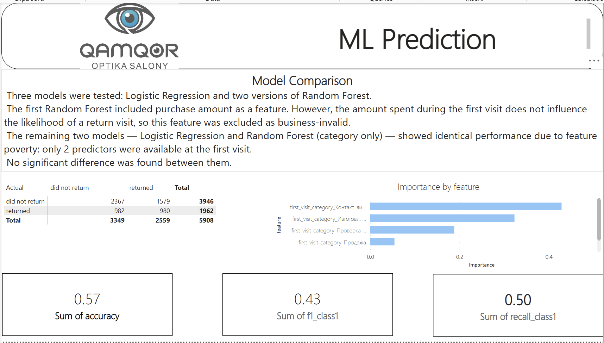
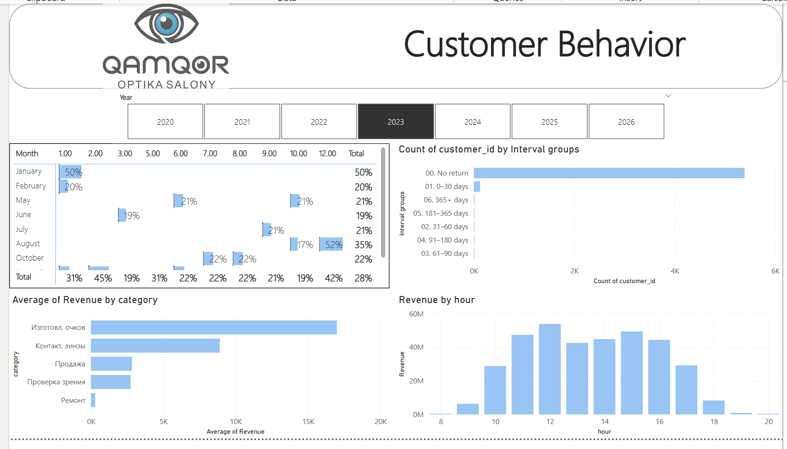
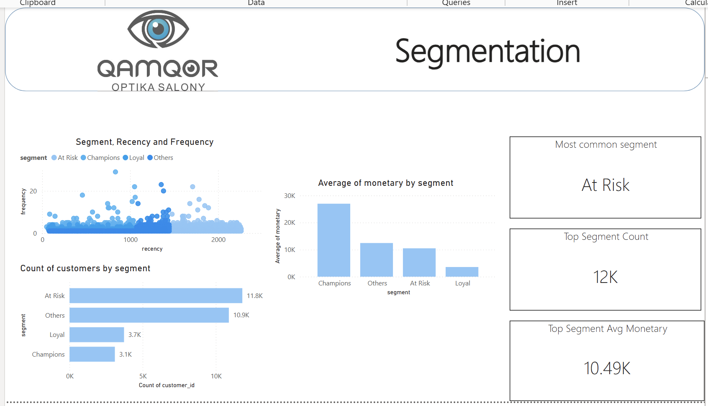

# Optical Retail Customer Analysis

Capstone project in product analytics (Outpeer, 2026). Customer segmentation, retention, and ML model predicting repeat visits.

## The problem

It was required to understand behavior of optical retail chain customer: why customers don't come back, who actually drives revenue, and whether a repeat visit can be predicted from first-visit data alone. The output is a Power BI dashboard, an ML model, and a set of recommendations.

## Data

~67,000 transactions from an optical retail chain in Kazakhstan, 03.2020–05.2026. After cleaning and merging with the customer database, 44,000 records remained. All data is anonymized — customer_id is an MD5 hash.

Stack: Python (pandas, scikit-learn) for cleaning and ML, PostgreSQL for cohort analysis and retention via SQL views, Power BI for dashboards.

## Data cleaning

"Eye exam" + "Purchase" data combinations on the same day were counted as one visit, created dublicates have been removed. Merged the customer database with transactions on customer_id. Ended up with 44,000 rows out of the original 67,000.

## Exploratory analysis

Overall retention is 33.3% (share of customers who returned at least once). For contact lenses specifically, it's 15.8% — and that's a problem: with an expected monthly repurchase cycle, customers should be coming back far more often.

On seasonality: August is the peak month for visits and revenue, and 2023 was the peak year for customer growth and revenue overall.

Cohorts and retention are computed via SQL views (`vw_customer_cohorts`, `vw_retention` in `sql/`).

## RFM segmentation

Recency / Frequency / Monetary, scored with NTILE in SQL (`vw_rfm`).

- **Champions** — buy often and recently, average ticket ~25K. The most valuable segment.
- **Loyal** — regular, but lower ticket size. Upsell candidates.
- **At Risk** — the largest segment, haven't visited in a while.
- **Others** — one-off purchases, minimal value.

## ML: predicting repeat visits

Attemped to predict whether a customer would return, using only what's known at the moment of their first visit — no leakage from future data. Dropped total_spent, number_of_visits, and days_since_last_purchase right away. First-visit purchase amount I checked separately: it doesn't actually affect return likelihood, so keeping it in the model would've been wrong from a business-logic standpoint.

What's left: first purchase type, age, and favorite category.

| Model | Accuracy | F1 (class "returned") |
|---|---|---|
| Logistic Regression | 0.57 | 0.43 |
| Random Forest | 0.57 | 0.43 |

Both models landed on the same result — not because the task is trivial, but because there just isn't much to work with: at the first visit, there's effectively one usable predictor (purchase type). Accuracy here comes in below actual retention (33%), which tracks given how thin the feature set is — not a sign the model itself is broken.

Confusion matrix (Random Forest):

| | Predicted: did not return | Predicted: returned |
|---|---|---|
| Actual: did not return | 2,367 | 1,579 |
| Actual: returned | 982 | 980 |

Top features by importance: first purchase type — contact lenses, then eyewear fitting, then eye exam.

## What to do with this

- The At Risk segment is the largest and currently gets no attention. An SMS/email campaign with a personalized offer is the obvious move.
- Contact lens retention is well below what a monthly repurchase cycle would predict — worth adding restock reminders.
- The model is bottlenecked by how little is known at first visit. Capturing a bit more at that stage (referral source, consultation type) would make prediction more useful.
- There's a hypothesis that a follow-up call improves return rates for lens customers — worth an A/B test.

  ## Dashboard

**Overview**


**Slowdown Analysis**


**Model Switchers**


**Loyal Clients**


## Repo structure

```
├── notebook/
│   ├── 01_cleaning.ipynb
│   ├── 02_eda.ipynb
│   └── 03_ml.ipynb
├── SQL/
│   └── cohort_retention_rfm.sql
├── PBI/
│   └── MKL_Retention.pbix
├── Data/
└── README.md
```

Raw transaction data with customer names is not included in this repo — only anonymized and aggregated datasets.

---

Valentina Yerokhina, product analytics, Outpeer 2026
